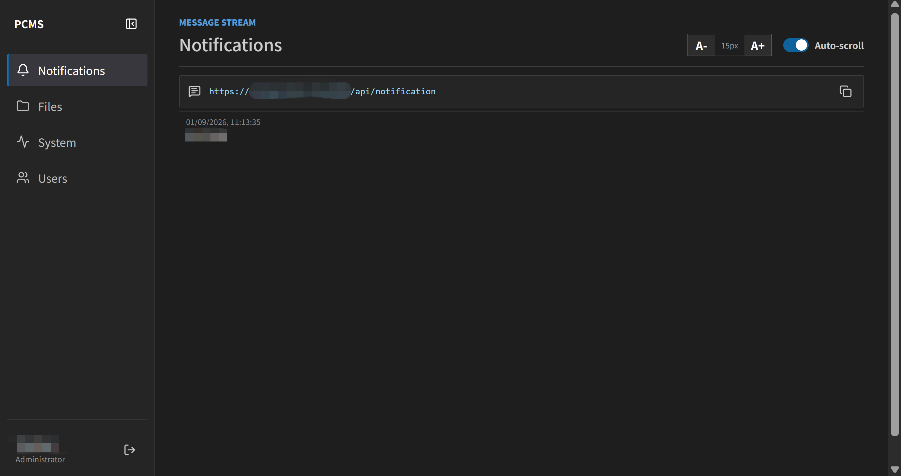
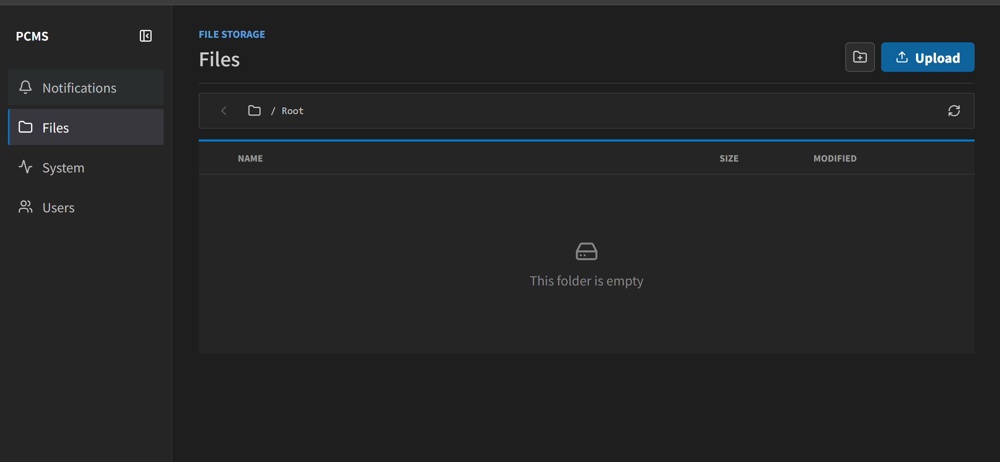
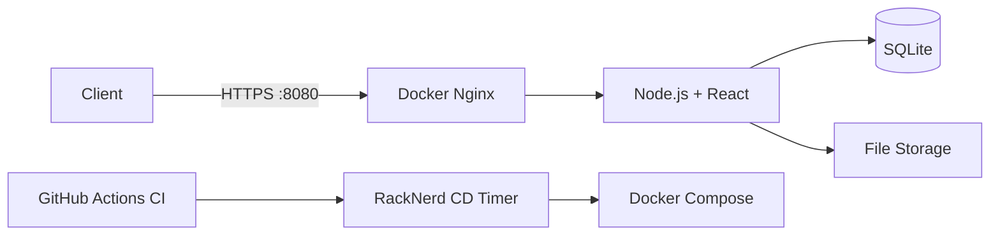

# Personal Content Management System

A small self-hosted dashboard for notifications, file sharing, server monitoring, shell access, and user management.


## Screenshots

| Notifications | Files |
| --- | --- | --- |
|  |  |

Add the screenshots as `imgs/notifications.png`, `imgs/files.png`, and `imgs/system.png`.


## Features

- Real-time notifications through HTTP and WebSocket
- File and folder upload/download
- CPU, memory, and disk monitoring
- Administrator shell and user management
- SQLite storage with salted password hashes

## Architecture



## Run Locally

```bash
cp .env.example .env
npm ci
npm run build
npm start
```

Both manual startup and Docker Compose read the root `.env` file. `DATA_DIR` controls data storage for manual startup, while Docker keeps using its `/app/data` volume mount. Open `/admin` to create the first administrator.

To run Docker on `8080` and then start a separate manual process on `8081`, create the Docker containers first with `PORT=8080`:

```bash
sed -i 's/^PORT=.*/PORT=8080/' .env
docker compose up -d --build
```

After the containers are running, change `.env` and start the manual process:

```bash
sed -i 's/^PORT=.*/PORT=8081/' .env
npm start
```

Changing `.env` does not reconfigure containers that are already running. A later `docker compose up` or container recreation will read the new value, so set `PORT=8080` again before recreating Docker services.

## Deployment

Production runs with Docker Compose in `/root/PersonalContentManagementSystem` on RackNerd. Every push to `master` starts GitHub Actions. After CI passes, the server detects the commit within one minute, rebuilds the containers, and removes unused images and build cache.

Persistent data is stored in `./data`. HTTPS uses Let's Encrypt with automatic renewal and a post-renewal gateway reload. The existing host service on port `443` is unchanged.

```bash
cp .env.example .env
docker compose ps
systemctl status pcms-update.timer
journalctl -u pcms-update.service
```

### Manual CD Control

The RackNerd server polls GitHub through `pcms-update.timer`. Pausing the timer stops push-triggered deployment without disabling GitHub Actions CI.

Pause automatic CD:

```bash
sudo systemctl disable --now pcms-update.timer
sudo systemctl stop pcms-update.service
sudo systemctl mask pcms-update.timer
systemctl status pcms-update.timer
```

Deploy the latest CI-approved `master` commit once while automatic CD remains paused:

```bash
sudo systemctl start pcms-update.service
sudo journalctl -u pcms-update.service -n 100 --no-pager
cd /root/PersonalContentManagementSystem
docker compose ps
```

Resume automatic CD:

```bash
sudo systemctl unmask pcms-update.timer
sudo systemctl enable --now pcms-update.timer
systemctl status pcms-update.timer
```

The current deployment script uses unauthenticated GitHub HTTPS and API access. If the repository becomes private, configure a deploy key or token before resuming automatic CD.

## Notification API

```bash
curl -X POST https://shenyanjian.top:8080/api/notification \
  -H 'Content-Type: application/json' \
  -d '{"message":"Deployment completed"}'
```