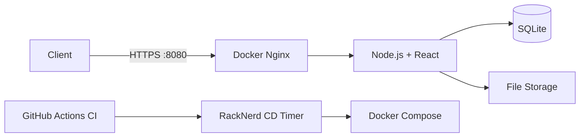

# Personal Content Management System

A small self-hosted dashboard for notifications, file sharing, server monitoring, shell access, and user management.


## Screenshots

| Notifications | Files |
| --- | --- | --- |
|  |  |

Add the screenshots as `imgs/notifications.png`, `imgs/files.png`, and `imgs/system.png`.


## Features

- Real-time notifications through HTTP and WebSocket
- File and folder upload/download
- CPU, memory, and disk monitoring
- Administrator shell and user management
- SQLite storage with salted password hashes

## Architecture



## Run Locally

```bash
npm install
npm run build
npm start
```

The service listens on port `8080`. Open `/admin` to create the first administrator.

## Deployment

Production runs with Docker Compose in `/root/PersonalContentManagementSystem` on RackNerd. Every push to `master` starts GitHub Actions. After CI passes, the server detects the commit within one minute, rebuilds the containers, and removes unused images and build cache.

Persistent data is stored in `./data`. HTTPS uses Let's Encrypt with automatic renewal and a post-renewal gateway reload. The existing host service on port `443` is unchanged.

```bash
docker compose ps
systemctl status pcms-update.timer
journalctl -u pcms-update.service
```

## Notification API

```bash
curl -X POST https://shenyanjian.top:8080/api/notification \
  -H 'Content-Type: application/json' \
  -d '{"message":"Deployment completed"}'
```